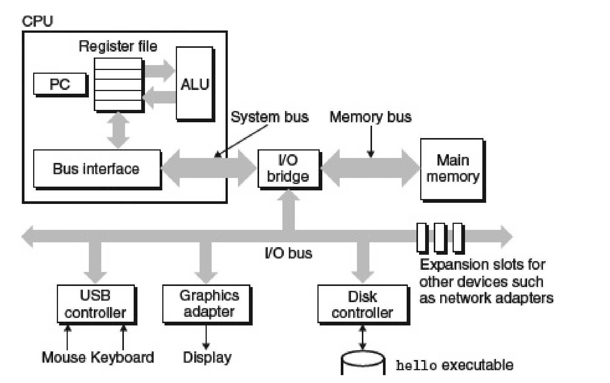
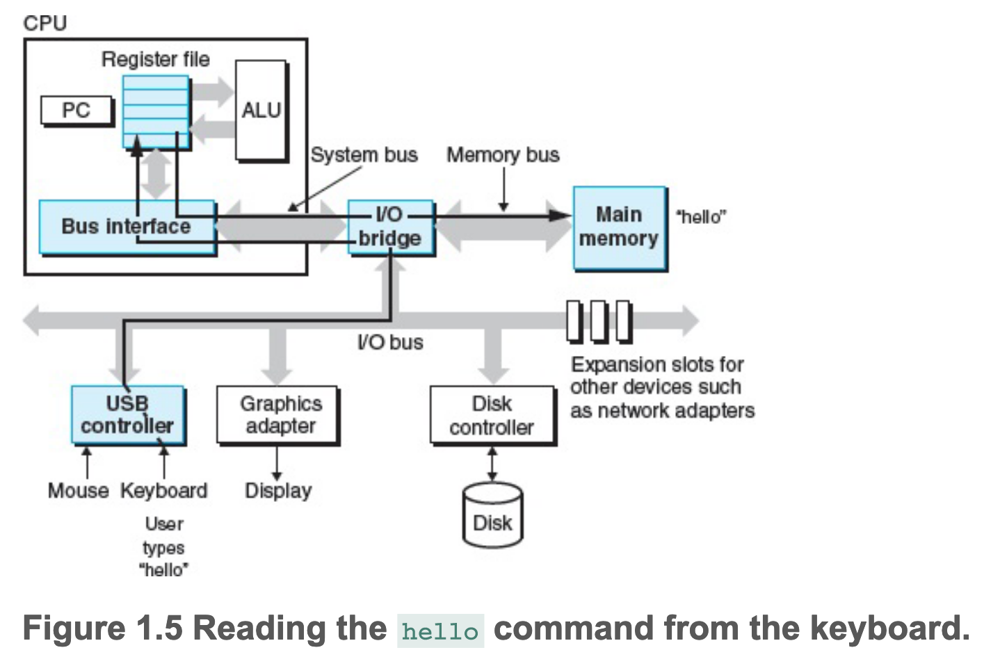

# 从代码到可执行文件

预处理(cpp 生成.i)->编译(cc1 生成.s)->汇编(as 生成.o)->链接(ld 生成可执行文件)

# 硬件系统

## 程序执行过程
1. 键入 enter 后，shell 读取到 enter 键入，开始执行

2. 将数据从硬盘加载到内存中，这里使用了 DMA(Direct memory access) 技术，绕开 CPU 直接从 IO 设备中将数据拷贝到内存。

3. CPU 执行程序并将结果输出到屏幕。

## 存储金字塔

# 系统抽象

抽象结构：进程->虚拟内存->文件

## 进程
进程间通过处理器切换上下文来实现并发，内核值的是内存中常驻的操作系统代码。

## 线程
线程是实际执行程序的单元，可以理解为操作系统将处理器 processor 切成了很多片，每个片对应一个线程。

在一个进程中有部分内容无法立即执行，又不希望频繁切换进程上下文时，可以从片中挂起等待的任务，并让同一个片执行其他能够执行的任务。

## 虚拟内存

内存地址从小到大分别是：程序代码和数据，堆，共享库，栈，os内核。
堆从下往上增长，栈从上往下增长。

## 文件

文件是字节流，读写文件其实是在读写一个个0和1的流。

## 网络

网络设备（网卡）可以看作一个 IO 设备，可以像文件那样表示（但是不是标准的 Linux 文件）

# Amdahl 定律

当我们加速系统的某一部分时，对整个系统性能的影响取决于该部分的重要性以及它的加速程度。

假设执行某个程序需要时间 $T_{old}$ ，其中比例为 $\alpha$ 的部分则为 $\alpha T_{old}$，优化的效率为 $k$，则此部分优化后的时间为 $\alpha T_{old}/k$。那么优化后整个系统的执行时间 $ T_{new}$ 为 

$$
T_{new} = (1-\alpha)T_{old} + (\alpha T_{old})/k
$$

加速比 $S=T_{old}/T_{new}$ 为
$$
S = \frac{1}{(1-\alpha)+\alpha / k}
$$