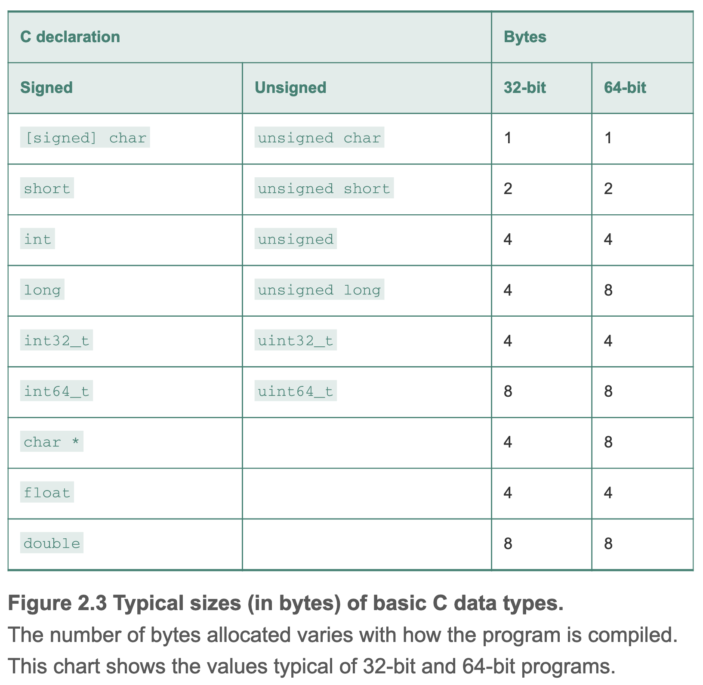
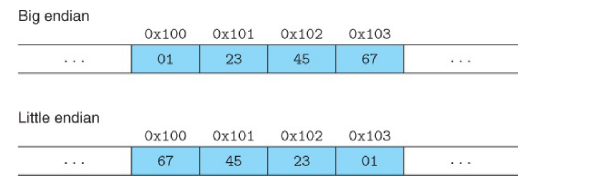
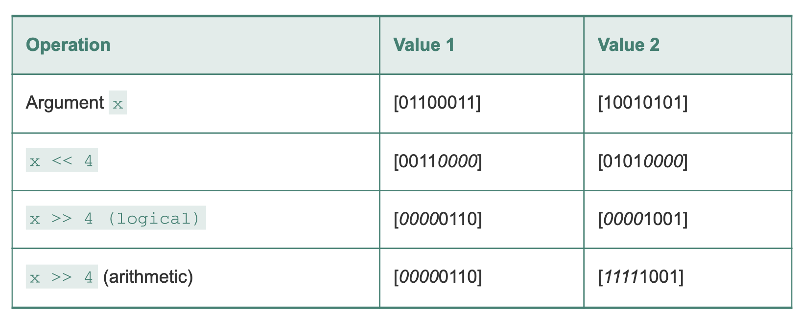
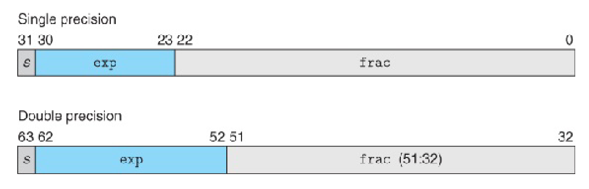
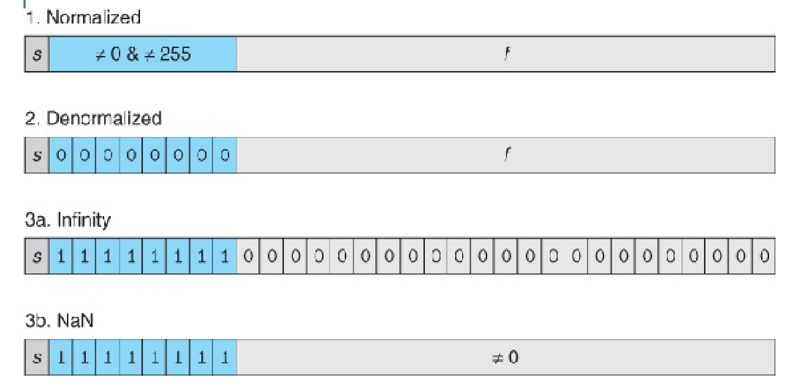

# 第二章 信息的表示和操作

## C 语言中基础类型在不同字长的计算机中的大小


## 寻址规则和字节顺序

对象的地址为使用字节的最小地址

### 小端法(little endian)

最低的有效字节在最前面

### 大端法(big endian)

最高的有效字节在最前面

假设一个 int 类型的变量 x = 0x01234567，变量地址为 0x100，则它在小端和大端机器中的表示分别为：



### 需要考虑大小端顺序的情况
1. 网络发送的字节流，从大端机器发送到小端机器；
2. 反汇编时的地址顺序；
3. 某些特殊机器系统编程需要指定大小端编译；

## C 语言中的移位操作

### 逻辑右移和算数右移

逻辑右移填充0，算数右移填充符号位，C 语言中有符号数是算术右移，无符号数逻辑右移



### 移动位数超过字长

移动位数位 k >= w，则只移动 k mod w 个位数

### 移位优先级

C 语言中加减法比移位优先级高
1 << 2 + 3 << 4 = 1 << (2+3) << 4 = 512


### C 语言有符号数隐式转换

当出现有符号数和无符号数的运算时，C 语言会默认将有符号数转为无符号数。

### C 语言中强制转换

```c
short sx = -12345;
unsigned uy = sx; // uy = 4294954951
```
从有符号类型 short 转为无符号类型 unsigned int，C 语言的转换顺序为 short -> int -> unsigned int 而不是 short -> unsigned short -> unsigned int。（后者的结果是 53191）

## 补码的定义

补码 Two's Completion，指的是对于字长为 w 的计算机，正数和负数能补完 $2^w$ 所有空间。正数的补码是它本身，负数的补码简单计算可以为其对应的正数取反+1。如 -1 在 $2^4$ 的空间中，其对应的正数为 1 ，转为2进制后为 0001，取反后为 1110， 再加 1 为 1111。 即 -1 在 $2^4$ 中的补码为 1111。

## IEEE 浮点表示

用 $ V = (-1)^s \times M \times 2^E $ 表示一个数
- 符号(sign): s=1 表示负数， s=0 表示正数
- 尾数(significand): M 是一个二进制小数，规格化时为 1+f, 非规格化时为 f，f 表示小数。
- 阶码(exponent): E, 规格化时为 e-Bias, 非规格化时为 1-Bias，这样设置是为了**平滑从非规格化到规格化的过渡**。
- 偏置(bias): Bias, 大小为 $ 2^{k-1}-1 $

k是阶码的有效位数，单精度为8，双精度为21





根据以上信息可以得出最大规格化数为:
$$
MaxFloat_{32} = (-1)^0 \times  (1-2^{-24})\times 2^{(2^8-1-(2^7-1))} = (1-2^{-24})\times 2^{128}
$$

$$
MaxFloat_{64} = (1-2^{-43}) \times 2^{1048576}
$$

## 舍入方式

向偶舍入，尽量让末尾为0，以下是小数点后保留2位有效数字：
$$
10.00011_2 \to 10.00_2\\
10.00110_2 \to 10.01_2\\
10.11100_2 \to 11.00_2\\
10.10100_2 \to 10.10_2
$$

## 舍入引入的问题

浮点运算的舍入导致加法仅具有交换性，不具有结合性和分配性。