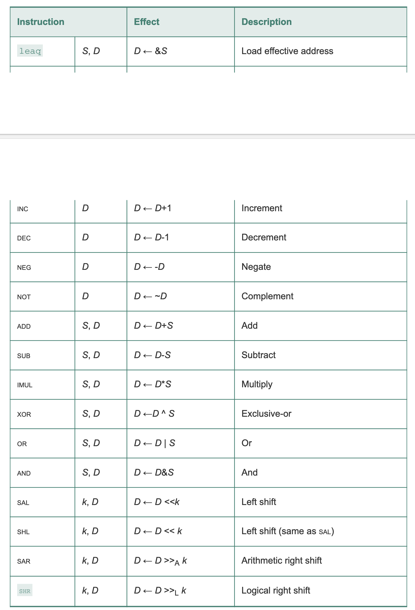

# 第三章 程序的机器级表示

## gcc 编译命令
> gcc -Og -S mstore.c

- -S 表示编译
- -Og 表示无优化

编译后生成汇编 `.s` 文件

## gcc 汇编命令
> gcc -Og -c mstore.c

- -c 表示汇编

汇编后生成二进制 `.o` 文件

用 `objdump -d msstore.o` 查看(默认 “AT&T” 格式，没有特殊说明均为此格式)

```bash
objdump -d mstore.o

mstore.o:     file format elf64-x86-64


Disassembly of section .text:

0000000000000000 <multsotre>:
   0:	f3 0f 1e fa          	endbr64
   4:	53                   	push   %rbx
   5:	48 89 d3             	mov    %rdx,%rbx
   8:	e8 00 00 00 00       	call   d <multsotre+0xd>
   d:	48 89 03             	mov    %rax,(%rbx)
  10:	5b                   	pop    %rbx
  11:	c3                   	ret
```

## C 语言到汇编语言的数据类型大小


## x86-64 整数寄存器


## 操作数指示符


## 汇编指令

### 移动指令

#### MOV


x86-64 限制从**内存**一个位置到**内存**另一个位置不能直接移动，例如 

```asm
mov 0x104, 0x108
``` 

是不被允许的，必须要通过寄存器中转

```asm
mov 0x104, %rax
mov %rax, 0x108
```

注意⚠️： `movl` 命令会把高位置为 0, 例如
```asm
movl $-1, %eax # 得到的 %rax 中的结果是 0x00000000FFFFFFFF
```

#### MOVZ 填0扩展
命令含有扩展的方向，比如 `bw` 表示1字节扩展到2字节


#### MOVS 符号扩展

符号扩展的意思是如果最高位为1，则空余的位都会填1。


其中的 `cltq` 命令只作用于 `%eax` 和 `%rax`，不用带操作数。
等价于 `movslq %eax, %rax`。

### pushq 和 popq


### 算术和逻辑运算



#### 取有效地址
`leaq` (load effective address) 可以将计算后的地址写入到目标寄存器，常用来计算而不是取地址。

#### 移位
移位操作的移位量可以是立即数或存在 `%cl` 中的值。`%cl` 是单字节寄存器，8位二进制 > 64，因此可以用来做 64 bit计算机的移位量。通过在移位操作后加 `b,w,l,q` 如 `shll` 或 `shrq` 来决定具体移动位数。

`b` 移动一个字节，用 `%cl` 中的低 3 位确定
`w` 移动一个字，用 `%cl` 中的低 4 位确定
`l` 移动双字，用 `%cl` 中的低 5 位确定
`q` 移动四字，用 `%cl` 中的低 6 位确定

示例：

```c
long arith(long x, long y, long z) {
    long t1 = x ^ y;
    long t2 = z * 48;
    long t3 = t1 & 0x0F0F0F0F;
    long t4 = t2 - t3;
    return t4;
}
```

```asm
long arith(long x, long y, long z)
x in %rdi, y in %rsi, z in %rdx
    arith:
        xorq %rsi, %rdi
        leaq (%rdx, %rdx, 2), %rax
        salq $4, %rax
        andl $252645135, %edi
        subq %rdi, %rax
        ret
```

### 乘法和除法

两个64位有符号或无符号数相乘需要128位(8字，oct word)，其中一个乘数必须存在于 `%rax` 寄存器中。乘积用 `%rdx` 存储高64位，用`%rax` 存储低64位。

最终结果保存在内存中，注意如果是小端机器，则高位(`%rdx`中的值)存储在大地址(addr+8)，低位(`%rax`中的值)存储到小地址(addr)；大端机器则相反。

除法则是将 `%rdx`和`%rax` 中的128位作为被除数，将指令的操作数作为除数。商存在 `%rax` 中，余数存在 `%rdx`中。


除法示例

```c
void remdiv(long x, long y, long *qp, long *rp) {
    long q = x / y;
    long r = x % y;
    *qp = q;
    *rp = r;
}

```

```asm
void remdiv(long x, long y, long *qp, long *rp)
x in %rdi, y in %rsi, qp in %rdx, rp in %rcx

remdiv:
    movq    %rdx, %r8      拷贝指针，空出 %rdx 寄存器
    movq    %rdi, %rax     x作为被除数移动到 %rax
    cqto                   有符号数扩展 128 位
    idivq   %rsi           商和余数分别保存到 %rax，%rdx
    movq    %rax, (%r8)    商移动到 %r8 指向的地址
    movq    %rdx, (%rcx)   余数移动到 %rcx 指向的地址
```

### 控制流

#### 条件码寄存器

当  t = a + b

| 标志 | C 表达式 | 含义 |
|-----|-----|-----|
|CF | (unsigned) t < (unsigned) a          | 无符号溢出|
|ZF | (t == 0)                             | 零       |
|SF | (t < 0)                              | 负数     |
|OF | (a < 0 == b < 0) && (t < 0 != a < 0) | 有符号溢出|

carry, zero, symbol, overflow

#### 修改条件码

除了 `leaq` 之外的所有算术和逻辑指令都会设置条件码

另外还有比较和测试的指令会设置条件码，这两个指令只设置条件码寄存器，而不改变其他寄存器。


#### 访问条件码


注意⚠️：`setl` 和 `setb` 中的 `l` 表示 less， `b` 表示 below。跟字节个数无关。

#### 跳转


当执行 PC 相对寻址时，程序计数器的值是跳转指令下一条指令的地址，而不是跳转指令本身的地址。

#### 条件移动

S 表示源，R 表示目的寄存器（为什么不用 D？）


因为传送需要先计算不同分支的语句，如果语句出现错误或者副作用，就会 panic ，因此慎用。


#### while

gcc 翻译 while 有两种策略：
- jump to middle(jm): 跳到最后，在最后条件判断再跳入循环
- guarded do(gd): 条件判断后进入循环

#### for

for 也可以被翻译成 jm 和 gd 两种形式。

#### switch语句

由一个跳转表 jump table + 一个 cmp 命令组成。 jump table 根据索引跳转到指定位置（普通分支），cmp 用来比较是否所有的索引都不匹配（default 分支）。


```c
void switch_eg(long x, long n, long *dest) {
    long val = x;
    switch (n) {
        case 100:
            val *= 13;
            break;
        case 102:
            val += 10;
        case 103:
            val += 11;
            break;
        case 104:
        case 106:
            val *= val;
            break;
        default:
            val = 0;
    }
    *dest = val;
}
```

```asm
switch_eg:
.LFB0:
        .cfi_startproc
        endbr64
        subq    $100, %rsi
        cmpq    $6, %rsi
        ja      .L8                 # n减100后大于6，则跳 default 分支
        leaq    .L4(%rip), %rcx     # 否则从.L4的表中找分支
        movslq  (%rcx,%rsi,4), %rax
        addq    %rcx, %rax
        notrack jmp     *%rax
        .section        .rodata
        .align 4
        .align 4
.L4: # jump table
        .long   .L7-.L4 # case 100
        .long   .L8-.L4 # case 101 default
        .long   .L6-.L4 # case 102
        .long   .L5-.L4 # case 103
        .long   .L3-.L4 # case 104
        .long   .L8-.L4 # case 105 default
        .long   .L3-.L4 # case 106
        .text
.L7: # case 100
        leaq    (%rdi,%rdi,2), %rax
        leaq    (%rdi,%rax,4), %rdi
        jmp     .L2
.L6: # case 102
        addq    $10, %rdi
.L5: # case 103
        addq    $11, %rdi
.L2: # switch 之后的语句，注意不在跳转表内
        movq    %rdi, (%rdx)
        ret
.L3: # case 104 和 case 106
        imulq   %rdi, %rdi
        jmp     .L2
.L8: # default
        movl    $0, %edi
        jmp     .L2
        .cfi_endproc
```

## 过程（函数）
过程 P 调用过程 Q 时，通过寄存器，过程 P 可以传递最多6个整数值（指针和整数），但如果 Q 需要更多参数，P 可以在调用 Q 之前在自己的栈帧中存储好这些参数。


### 地址转移控制流程： 
- `call`: `sub $8, %rsp`, `mov %rip下一条指令的地址, (%rsp)`, `mov Q的地址,%rip`(即 `pushq %rip下一条指令的地址`,`jmp Q的地址`)
- `ret`: 跟 `call` 正好相反


### 数据传送

栈内6个参数与寄存器对应关系


### 栈上局部存储

- 寄存器数量不够
- 对一个局部变量使用 `&` 取地址符号，此时会把变量 x 的值存入栈帧内存中，生成的栈帧内的地址给到 &x
- 某些局部变量是数组或者结构，需要使用引用才能访问

栈内变量顺序：一般栈顶(`%rsp` 减最多的地址)会存放最先出现的变量

## 指针

指针从一种类型强制转为另一种类型，只改变类型而不改变值。
指针强制转换的优先级高于加法
```c
char *p
(int *) p + 7    // p+28
(int *) (p + 7) // p+7
```

## 缓冲溢出保护

### 栈随机化
每次运行时栈的位置发生变化，但防不住 nop sled 空操作雪橇攻击

### 栈破坏检测
在栈的局部缓冲区和栈状态之间插入随机产生的一个金丝雀(canary)值，也叫守卫值(guard value)。当这个值被溢出破坏时，程序异常中止。使用命令行选项 `-fno-stack-protector` 可以去掉此检测。

### 限制可执行代码区域
读、写、执行分离


## AVX 媒体寄存器
用于存浮点数，单精度和双精度浮点数都存于 XMM 寄存器


## 浮点数移动指令
引用内存的指令都是**标量指令**，只能移动单个数据值。
GCC 只用标量指令从内存到寄存器或者从寄存器到内存移动数据；从寄存器到寄存器会使用 `vmosaps`和`vmosapd`。


## 浮点数整数转换指令

### 浮点数转整数
vcvttss2si: 全称为 Vector Convert with Truncate Scalar Single-Precision to Signed Integer


### 整数转浮点数
可以忽略源2，源2只会影响结果的高位字节，常见命令如 `vcvtsi2sdq %rax %xmm1 %xmm1`，表示将一个 long 类型转换为 double 类型。


### 浮点数转浮点数(GCC)

```asm
vcvtss2sd %xmm0 %xmm0
```

## 浮点数算术运算

注意⚠️：浮点数不能用立即数


## 浮点数位运算


## 浮点数比较操作(AVX2标准)


vucomiss: Unordered Compare and Set Flags with Scalar Double-Precision Floating-Point

unordered 表示支持 NaN 的比较


## 补充
### 为什么 cmov 比 jmp 高效(粗略估计，根据第四章并非如此)

CPU 流水线阶段：

1. F (Fetch): 取指令。
2. D (Decode): 解码指令。
3. E (Execute): 执行指令。
4. M (Memory Access): 访存。
5. W (Write Back): 写回寄存器。
6. U (PC update): 更新PC

延迟和时钟周期：

假设每个阶段耗费 1 个时钟周期，跳转失败会导致流水线被刷新，重新开始加载新指令，通常需要 额外 10-20 个周期 的代价（假设 10）。
假设分支预测正确率为 50%。

示例 C 代码如下：

```c
int cmp1(int x, int y) {
	if (x > y)
		return x;
	else
		return y;
}

int cmp2(int x, int y) {
	return (x > y) ? x : y;
}
```

汇编代码如下：

```asm
0000000000000000 <cmp1>:
   0:	f3 0f 1e fa          	endbr64
   4:	89 f0                	mov    %esi,%eax
   6:	39 f7                	cmp    %esi,%edi
   8:	7e 02                	jle    c <cmp1+0xc>
   a:	89 f8                	mov    %edi,%eax
   c:	c3                   	ret

000000000000000d <cmp2>:
   d:	f3 0f 1e fa          	endbr64
  11:	39 fe                	cmp    %edi,%esi
  13:	89 f8                	mov    %edi,%eax
  15:	0f 4d c6             	cmovge %esi,%eax
  18:	c3                   	ret
```
<style>
    tr.normalbk{
        background-color: #E9F0ED;
    }
    td {
        font-family: 'JetbrainsMono Nerd Font Mono', serif; /* 替代字体，可调整 */
    }
    td.normal {
        color: #4A7D68;
        background-color: #E9F0ED;
    }
    td.wrong {
        color: #DB0101; 
        background-color: #FFCFC5;
    }
</style>

#### 基于跳转的代码 cmp1

<table>
	<tr>
	    <td rowspan=2 align=center>指令</td>
	    <td colspan=15 align=center>周期</td>
	</tr >
	<tr >
	    <td>1</td>
        <td>2</td>
        <td>3</td>
        <td>4</td>
        <td>5</td>
        <td>6</td>
        <td>7</td>
        <td>...</td>
        <td>18</td>
        <td>19</td>
        <td>20</td>
        <td>21</td>
        <td>22</td>
        <td>...</td>
	</tr>
	<tr>
	    <td class=normal>mov %esi,%eax</td>
	    <td>F</td>
        <td>D</td>
        <td>E</td>
        <td>M</td>
        <td>W</td>
        <td></td>
        <td></td>
        <td></td>
        <td></td>
        <td></td>
        <td></td>
        <td></td>
        <td></td>
        <td>...</td>
	</tr>
    <tr>
	    <td class=normal>cmp %esi,%edi</td>
	    <td></td>
        <td>F</td>
        <td>D</td>
        <td>E</td>
        <td>M</td>
        <td>W</td>
        <td></td>
        <td></td>
        <td></td>
        <td></td>
        <td></td>
        <td></td>
        <td></td>
        <td>...</td>
	</tr>
    <tr>
	    <td class=normal>jle</td>
        <td></td>
        <td></td>
	    <td>F</td>
        <td>D</td>
        <td>E</td>
        <td>M</td>
        <td>W</td>
        <td></td>
        <td></td>
        <td></td>
        <td></td>
        <td></td>
        <td></td>
        <td>...</td>
	</tr>
    <tr>
	    <td class=wrong>mov %esi,%eax</td>
        <td></td>
        <td></td>
        <td></td>
        <td></td>
        <td></td>
        <td></td>
        <td></td>
        <td>10个周期代价</td>
	    <td>F</td>
        <td>D</td>
        <td>E</td>
        <td>M</td>
        <td>W</td>
        <td>...</td>
	</tr>
</table>

期望：  $ E(circle) = 0.5*7 + 0.5 * 22 = 14.5$

#### 基于条件移动的代码 cmp2

<table>
	<tr>
	    <td rowspan=2 align=center>指令</td>
	    <td colspan=15 align=center>周期</td>
	</tr >
	<tr >
	    <td>1</td>
        <td>2</td>
        <td>3</td>
        <td>4</td>
        <td>5</td>
        <td>6</td>
        <td>7</td>
        <td>...</td>
        <td>18</td>
        <td>19</td>
        <td>20</td>
        <td>21</td>
        <td>22</td>
        <td>...</td>
	</tr>
	<tr>
	    <td class=normal>cmp %edi,%esi</td>
	    <td>F</td>
        <td>D</td>
        <td>E</td>
        <td>M</td>
        <td>W</td>
        <td></td>
        <td></td>
        <td></td>
        <td></td>
        <td></td>
        <td></td>
        <td></td>
        <td></td>
        <td>...</td>
	</tr>
    <tr>
	    <td class=normal>mov %edi,%eax</td>
	    <td></td>
        <td>F</td>
        <td>D</td>
        <td>E</td>
        <td>M</td>
        <td>W</td>
        <td></td>
        <td></td>
        <td></td>
        <td></td>
        <td></td>
        <td></td>
        <td></td>
        <td>...</td>
	</tr>
    <tr>
	    <td class=normal>cmovge %esi,%eax</td>
        <td></td>
        <td></td>
	    <td>F</td>
        <td>D</td>
        <td>E</td>
        <td>M</td>
        <td>W</td>
        <td></td>
        <td></td>
        <td></td>
        <td></td>
        <td></td>
        <td></td>
        <td>...</td>
	</tr>
</table>

期望：  $ E(circle) = 1*7 = 7$

