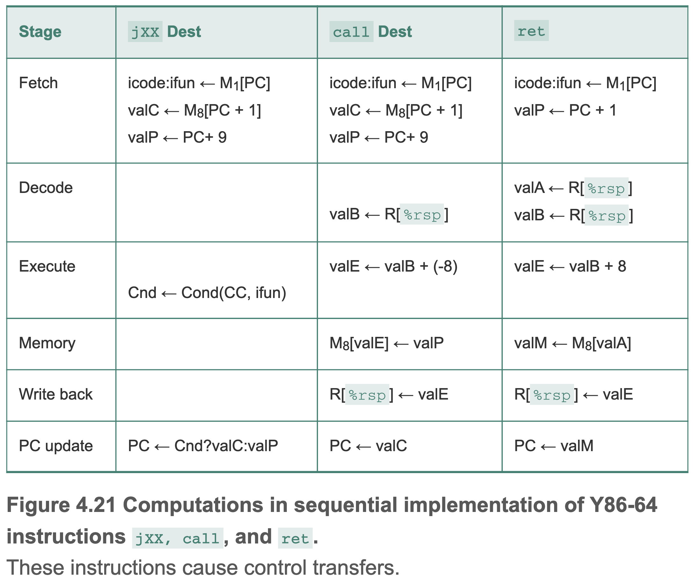
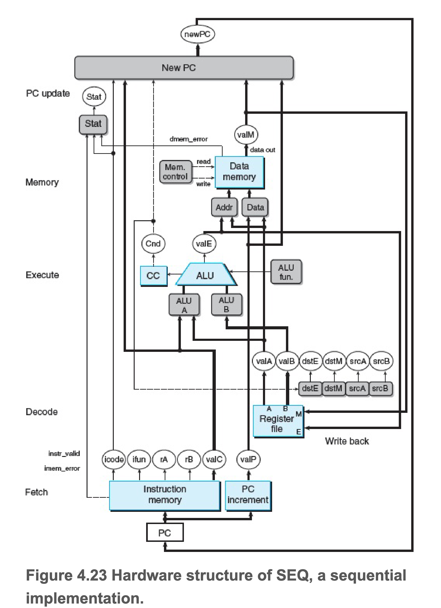
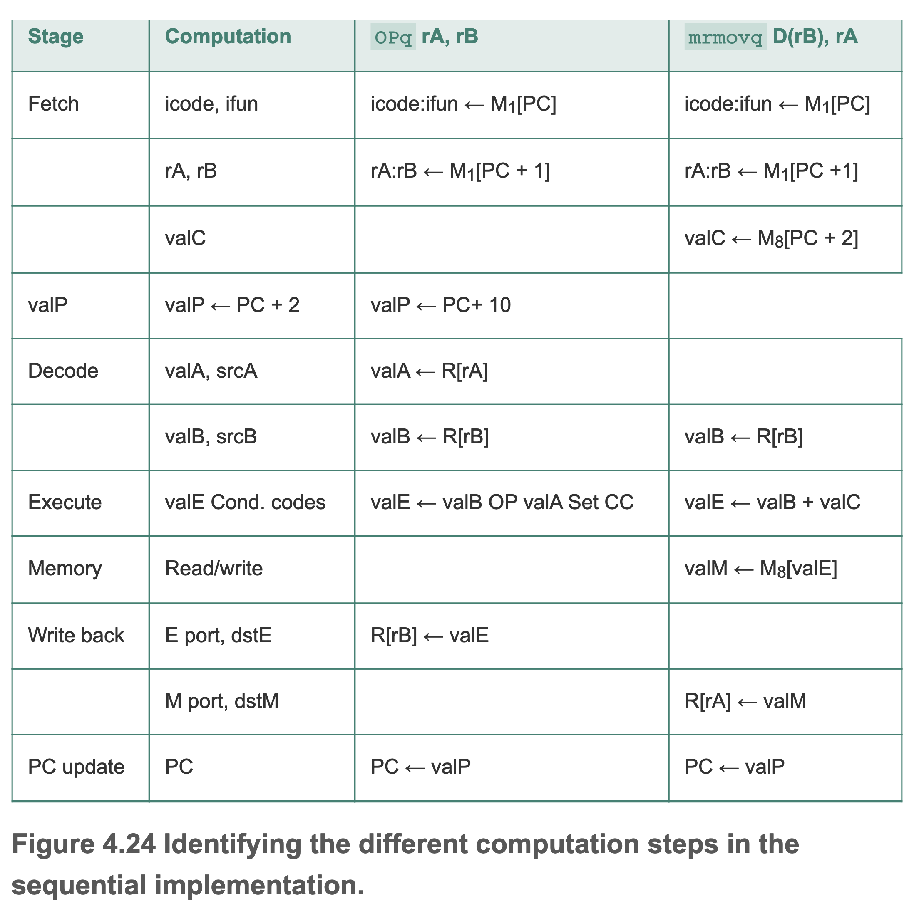

# 第四章 处理器体系结构

## 自定义指令集 Y86-64

### Y86-64 程序员可见状态

#### **RF: 程序员寄存器** 
共 15 个
| No.    | Register | No.    | Register |
|--------|----------|--------|----------|
|   0    |  `%rax`  |   8    |  `%r8`   |
|   1    |  `%rcx`  |   9    |  `%r9`   |
|   2    |  `%rdx`  |   A    |  `%r10`  |
|   3    |  `%rbx`  |   B    |  `%r11`  |
|   4    |  `%rsp`  |   C    |  `%r12`  |
|   5    |  `%rbp`  |   D    |  `%r13`  |
|   6    |  `%rsi`  |   E    |  `%r14`  |
|   7    |  `%rdi`  |   F    |  None    |

#### **CC: 条件码**
共 3 个，分别为 0标志，符号标志和溢出标志
| ZF | SF | OF |
|----|----|----|

#### **PC: 程序计数器**
存放当前执行的指令地址

#### **Stat: 程序状态**

存放程序是正常运行还是异常，任何非 AOK 的状态都会让程序停止。

| Value | Name | Meaning         |
|-------|------|-----------------|
|   1   | AOK  | 正常操作         |
|   2   | HLT  | 遇到执行 halt 指令|
|   3   | ADR  | 遇到非法地址      |
|   4   | INS  | 遇到非法指令      |

#### **DMEM: 内存**

###  Y86-64指令集

| Instruction Byte  |0   |1    |2|3|4|5|6|7|8|9|
|-------------------|----|-----|-|-|-|-|-|-|-|-|
| `halt`            |0 0 |     | | | | | | | | |
| `nop`             |1 0 |     | | | | | | | | |
| `rrmovq rA, rB`   |2 0 |rA rB| | | | | | | | |
| `irmovq V, rB`    |3 0 |F rB |V| | | | | | | |
| `rmmovq rA, D(rB)`|4 0 |rA rB|D| | | | | | | |
| `mrmovq D(rB), rA`|5 0 |rA rB|D| | | | | | | |
| `OPq rA, rB`      |6 fn|rA rB| | | | | | | | |
| `jXX Dest`        |7 fn|Dest | | | | | | | | |
| `cmovXX rA, rB`   |2 fn|rA rB| | | | | | | | |
| `call Dest`       |8 0 |Dest | | | | | | | | |
| `ret`             |9 0 |     | | | | | | | | |
| `pushq rA`        |A 0 |rA F | | | | | | | | |
| `popq rA`         |B 0 |rA F | | | | | | | | |

总长度从 1 byte 到 10 byte 不等，根据具体的指令计算。

- `halt`， 程序停止，并将程序状态码设置为 HLT
- `nop`，啥也不做，PC+1
- `xxmovq`，立即数、寄存器、内存之间移动
- `OPq`，4个整数操作指令
- `jXX`，7个分支指令
- `cmov`，6个条件移动指令
- `call`，将返回地址压入栈中，并跳转到目标地址
- `ret`，弹出返回地址，并跳转到弹出的地址
- `pushq`，将寄存器中的值压入栈中
- `popq`，将栈中的值弹出到寄存器

目标地址 Dest 为绝对地址。
所有整数采用小端法编码。

**`OPq`**
| Instruction  |    |
|--------------|----|
| `addq`       |6 0 |
| `subq`       |6 1 |
| `andq`       |6 2 |
| `xorq`       |6 3 |

**`jXX`**
| Instruction  |    |
|--------------|----|
| `jmp`        |7 0 |
| `jle`        |7 1 |
| `jl`         |7 2 |
| `je`         |7 3 |
| `jne`        |7 4 |
| `jge`        |7 5 |
| `jg`         |7 6 |

**`cmovXX`**
| Instruction  |    |
|--------------|----|
| `comvle`     |2 1 |
| `comvl`      |2 2 |
| `comve`      |2 3 |
| `comvne`     |2 4 |
| `comvge`     |2 5 |
| `comvg`      |2 6 |

## SEQ 处理器

### 处理器阶段

1. F (Fetch): 取出 icode 指令代码和 ifun 指令功能。可能取出 **1** 字节用来表示寄存器，可能取出 **8** 字节表示常数或地址 valC。并按顺序计算下一个 PC 值 valP。
2. D (Decode): 从寄存器rA, rB读值，得到 valA/valB，有些指令（如 push和pop）会在此阶段读 `%rsp`。
3. E (Execute): 执行算术或逻辑运算，计算内存引用的有效地址，增加或减少栈指针等，得到 valE。同时也可能设置或检查条件码。
4. M (Memory Access): 可以将数据写入内存或从内存读出，读出的值为 valM。
5. W (Write Back): 最多将2个结果写回寄存器。
6. U (PC update): 更新PC为 valP。

示例：jmp、call和ret的流水线阶段，其余指令可以参考书，都有示例。

### 硬件结构

- 白色方框表示时钟寄存器，程序计数器 PC 是 SEQ 的唯一时钟寄存器
- 浅蓝色方框表示硬件单元，当成“黑盒子”使用，不关心细节
- 黑色圆角矩形表示控制逻辑块，用来从一组源信号中选择或者计算布尔值，之后会详细分析这些块
- 白色圆圈表示线路名称，并非硬件单元
- 粗线表示字大小（64位）的数据，每条线实际由64根线构成
- 细线表示字节或更小的数据，每条线由4根或8根线构成
- 虚线表示位的数据，代表芯片上单元与块之间传递的控制值

srcA，valA的源；srcB，valB的源；dstE，写入 valE 的寄存器；dstM，写入 valM 的寄存器。

### SEQ 时序

SEQ 的实现包括
- 组合逻辑：HCL(Hardware Control Language) 描述
- 时钟存储器：程序计数器、条件码寄存器
- 随机访问存储器：寄存器文件、指令内存、数据内存

其中，组合逻辑不需要控制，只要输入变化，值就能通过门电路传播。指令内存也不需要控制，指令内存只用于读指令。

剩余的程序计数器、条件码寄存器、寄存器文件和数据内存都通过一个时钟信号来控制。

每个时钟周期，程序计数器都会装载新的指令地址；只有在执行整数运算时，才会装载条件码寄存器；只有在执行 rmmovq、pushq和call指令时，才会写数据内存。寄存器文件的两个写端口允许每个时钟周期更新两个寄存器(比如pop指令，会写回%rsp和目标寄存器)，不过可以用特殊的寄存器ID 0xF 作为端口地址，来表明不该执行的写操作。

## 补充

### 如何从01转换为图形

以 ASCII 码举例
1. 用户输入 65
2. 操作系统调用图形接口需要显示 'A'
3. 图形接口查找字体文件，将字符 'A' 转换为像素点
4. 显卡接收操作系统传来的绘图指令（如要显示 'A' 的像素点）
5. 显卡将这些像素点翻译成信号（如RGB值）传递给显示器
6. 显示器将图像信号渲染成颜色