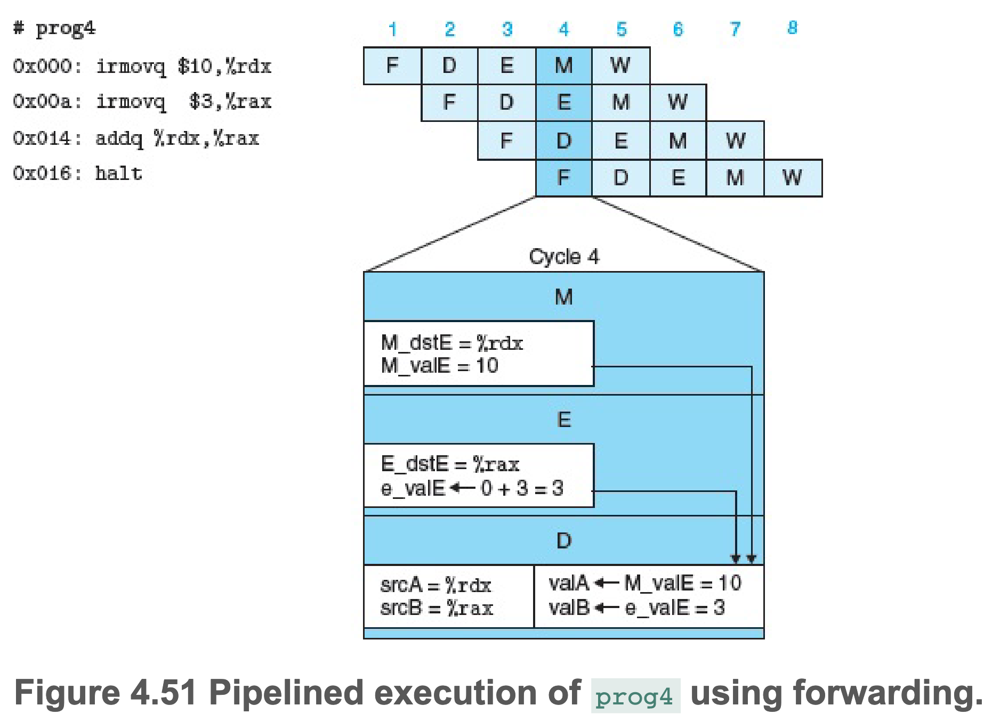

# 第四章 处理器体系结构

## 自定义指令集 Y86-64

### Y86-64 程序员可见状态

#### **RF: 程序员寄存器** 
共 15 个
| No.    | Register | No.    | Register |
|--------|----------|--------|----------|
|   0    |  `%rax`  |   8    |  `%r8`   |
|   1    |  `%rcx`  |   9    |  `%r9`   |
|   2    |  `%rdx`  |   A    |  `%r10`  |
|   3    |  `%rbx`  |   B    |  `%r11`  |
|   4    |  `%rsp`  |   C    |  `%r12`  |
|   5    |  `%rbp`  |   D    |  `%r13`  |
|   6    |  `%rsi`  |   E    |  `%r14`  |
|   7    |  `%rdi`  |   F    |  None    |


#### **CC: 条件码**
共 3 个，分别为 0标志，符号标志和溢出标志
| ZF | SF | OF |
|----|----|----|

#### **PC: 程序计数器**
存放当前执行的指令地址

#### **Stat: 程序状态**

存放程序是正常运行还是异常，任何非 AOK 的状态都会让程序停止。

| Value | Name | Meaning         |
|-------|------|-----------------|
|   1   | AOK  | 正常操作         |
|   2   | HLT  | 遇到执行 halt 指令|
|   3   | ADR  | 遇到非法地址      |
|   4   | INS  | 遇到非法指令      |


#### **DMEM: 内存**


###  Y86-64指令集

| Instruction Byte  |0   |1    |2|3|4|5|6|7|8|9|
|-------------------|----|-----|-|-|-|-|-|-|-|-|
| `halt`            |0 0 |     | | | | | | | | |
| `nop`             |1 0 |     | | | | | | | | |
| `rrmovq rA, rB`   |2 0 |rA rB| | | | | | | | |
| `irmovq V, rB`    |3 0 |F rB |V| | | | | | | |
| `rmmovq rA, D(rB)`|4 0 |rA rB|D| | | | | | | |
| `mrmovq D(rB), rA`|5 0 |rA rB|D| | | | | | | |
| `OPq rA, rB`      |6 fn|rA rB| | | | | | | | |
| `jXX Dest`        |7 fn|Dest | | | | | | | | |
| `cmovXX rA, rB`   |2 fn|rA rB| | | | | | | | |
| `call Dest`       |8 0 |Dest | | | | | | | | |
| `ret`             |9 0 |     | | | | | | | | |
| `pushq rA`        |A 0 |rA F | | | | | | | | |
| `popq rA`         |B 0 |rA F | | | | | | | | |

总长度从 1 byte 到 10 byte 不等，根据具体的指令计算。

- `halt`， 程序停止，并将程序状态码设置为 HLT
- `nop`，啥也不做，PC+1
- `xxmovq`，立即数、寄存器、内存之间移动
- `OPq`，4个整数操作指令
- `jXX`，7个分支指令
- `cmov`，6个条件移动指令
- `call`，将返回地址压入栈中，并跳转到目标地址
- `ret`，弹出返回地址，并跳转到弹出的地址
- `pushq`，将寄存器中的值压入栈中
- `popq`，将栈中的值弹出到寄存器

目标地址 Dest 为绝对地址。
所有整数采用小端法编码。


**`OPq`**
| Instruction  |    |
|--------------|----|
| `addq`       |6 0 |
| `subq`       |6 1 |
| `andq`       |6 2 |
| `xorq`       |6 3 |

**`jXX`**
| Instruction  |    |
|--------------|----|
| `jmp`        |7 0 |
| `jle`        |7 1 |
| `jl`         |7 2 |
| `je`         |7 3 |
| `jne`        |7 4 |
| `jge`        |7 5 |
| `jg`         |7 6 |

**`cmovXX`**
| Instruction  |    |
|--------------|----|
| `comvle`     |2 1 |
| `comvl`      |2 2 |
| `comve`      |2 3 |
| `comvne`     |2 4 |
| `comvge`     |2 5 |
| `comvg`      |2 6 |


## SEQ 处理器

### 处理器阶段

1. F (Fetch): 取出 icode 指令代码和 ifun 指令功能。可能取出 **1** 字节用来表示寄存器，可能取出 **8** 字节表示常数或地址 valC。并按顺序计算下一个 PC 值 valP。
2. D (Decode): 从寄存器rA, rB读值，得到 valA/valB，有些指令（如 push和pop）会在此阶段读 `%rsp`。
3. E (Execute): 执行算术或逻辑运算，计算内存引用的有效地址，增加或减少栈指针等，得到 valE。同时也可能设置或检查条件码。
4. M (Memory Access, 以下简写为 Memory): 可以将数据写入内存或从内存读出，读出的值为 valM。
5. W (Write Back, 以下简写为 Write): 最多将2个结果写回寄存器。
6. U (PC update): 更新PC为 valP。

示例：jmp、call和ret的流水线阶段，其余指令可以参考书，都有示例。


### 硬件结构


- 白色方框表示时钟寄存器，程序计数器 PC 是 SEQ 的唯一时钟寄存器
- 浅蓝色方框表示硬件单元，当成“黑盒子”使用，不关心细节
- 黑色圆角矩形表示控制逻辑块，用来从一组源信号中选择或者计算布尔值，之后会详细分析这些块
- 白色圆圈表示线路名称，并非硬件单元
- 粗线表示字大小（64位）的数据，每条线实际由64根线构成
- 细线表示字节或更小的数据，每条线由4根或8根线构成
- 虚线表示位的数据，代表芯片上单元与块之间传递的控制值

srcA，valA的源；srcB，valB的源；dstE，写入 valE 的寄存器， Excute 阶段写入的目的寄存器；dstM，写入 valM 的寄存器，Memory 阶段写入的目的寄存器。


### SEQ 时序

SEQ 的实现包括
- 组合逻辑：HCL(Hardware Control Language) 描述
- 时钟存储器：程序计数器、条件码寄存器
- 随机访问存储器：寄存器文件、指令内存、数据内存

其中，组合逻辑不需要控制，只要输入变化，值就能通过门电路传播。指令内存也不需要控制，指令内存只用于读指令。

剩余的程序计数器、条件码寄存器、寄存器文件和数据内存都通过一个时钟信号来控制。

每个时钟周期，程序计数器都会装载新的指令地址；只有在执行整数运算时，才会装载条件码寄存器；只有在执行 rmmovq、pushq和call指令时，才会写数据内存。寄存器文件的两个写端口允许每个时钟周期更新两个寄存器(比如pop指令，会写入 `%rsp` 和目标寄存器)，不过可以用特殊的寄存器ID 0xF 作为端口地址，来表明不该执行的写操作。


### SEQ 阶段的实现
#### 1. 取指阶段


- 以 PC 作为第 1 个字节(字节 0)，一次从内存中读取 10 个字节
- "Split" 将第 1 个字节分成 4 位的两段，分别为 icode 和 ifun
- 根据 icode 值，计算三个 1 位的信号 instr_valid，need_regids，need_valC
- instr_valid 表示指令是否合法，若不合法，icode 和 ifun 会变成指令 NOP 的内容
- need_regids 表示是否需要寄存器，若需要，第 2 个字节(字节 1)会被分割为 rA 和 rB 寄存器，若只需要 1 个寄存器，另一个会被置为 0xF(RNODE)
- need_valC 表示是否需要变量，若需要，"Align" 会根据 need_regids 值取字节 1～8 或字节 2～9

**HCL**
```hcl
bool need_regids = icode in {IRRMOVQ, IOPQ, IPUSHQ, IPOPQ, IIRMOVQ, IRMMOVQ, IMRMOVQ}
```

#### 2. 译码和写回阶段


- 读端口的地址输入为 srcA 和 srcB，写端口的地址为 dstE 和 dstM。如果某个地址端口上的值为 0xF(RNODE)，则表示不需要访问寄存器

**HCL**
```hcl
word srcA = [
    icode in {IRRMOVQ, IRMMOVQ,IOPQ, IPUSHQ}: rA;
    icode in {IPOPQ, IRET}: RRSP;
    1: RNODE; # don't need register
]
```

#### 3. 执行阶段


- aluB 在前，aluA 在后，为了使 subq 指令是 valB-valA
- 根据 ALU 的值，设置条件码寄存器
- 检测条件码寄存器，判断是否该选择分支

**HCL**
```hcl
word aluA = [
    icode in {IRRMOVQ, IOPQ}: valA;
    icode in {IIRMOVQ, IRMMOVQ, IMRMOVQ}: valC;
    icode in {ICALL, IPUSHQ}: -8;
    icode in {IRET, IPOPQ}: 8;
]

word alufun = [
    icode == IOPQ: ifun;
    1: ALUADD;
]

bool set_cc = icode in {IOPQ};
```

#### 4. 访存阶段


从内存中读出的值形成信号 valM。

#### 5. 更新 PC 阶段


```hcl
word new_pc = [
    icode == ICALL: valC;
    icode == IJXX && Cnd: valC;
    icode == IRET: valM;
    1: valP;
]
```

## 流水线

可以提高吞吐量(throughput)，但是会有延迟(latency)

流水线的局限性
- 不一致的划分：不同阶段的延迟不同，导致延迟低的阶段需要配合延迟高的阶段
- 流水线过深：由于到寄存器的拷贝时间固定，流水线阶段越多，拷贝的延迟越长，导致收益下降

## SEQ+处理器(Y86-64 流水线设计)

将 PC 的计算提前到流水线开始的时候，由上次流水线结果来计算，无需专门的 PC 寄存器保存。这种改动成为电路重定时(circuit retiming)。


## PIPE-处理器

*\- 表示跟最终实现相比还差一点性能*


与顺序设计 SEQ 几乎一样的硬件单元，但是有流水线寄存器分隔开这些阶段。
流水线寄存器中的白色方框表示真实的硬件（与SEQ的白色圆圈不同）

|   流水线寄存器  |         阶段位置       |                                保存内容                                    |
|---------------|-----------------------|--------------------------------------------------------------------------|
|F              |                       | 保存程序计数器的预测值                                                       |
|D              |Fetch 和 Decode 之间    | 保存取出的指令的信息，即将由译码阶段处理                                        |
|E              |Decode 和 Execute 之间  | 保存译码的指令和从寄存器文件读出的值的信息，即将由执行阶段处理                      |
|M              |Execute 和 Memory 之间  | 保存执行的指令的结果、用于处理条件转移的分支条件和分支目标的信息，即将由执行阶段处理   |
|W              |Memory 和 Feedback 之间 | 将计算反馈路径写入寄存器文件，当完成 ret 指令时，还要向 PC 选择逻辑提供返回地址      |


## 流水线冒险(hazard)

- 数据相关：下一条指令会使用到这一条指令计算出的结果
- 控制相关：下一条指令的位置收到这一条指令的控制，例如在跳转、调用或返回时

### 数据冒险

在上一条指令的还未写入指定寄存器时，下一条指令就至少执行到解码阶段（即从指定寄存器取指），此时会取到一个错误值

#### 用暂停来避免数据冒险
将下一条指令暂停在 Decode 阶段，直到上一条指令完成写入，类似于插入 `nop` 指令，有性能问题


#### 用转发来避免数据冒险

数据转发(data forwarding)也称旁路(bypassing)，分三种情况讨论。

1.  Decode阶段发现`%rax`是操作数 valB 的源寄存器，而在之前指令的 Write 阶段写端口 E 上还有一个对 `%rax` 未进行的写。只要简单地将提供到端口 E 的数据字(信号 W_valE)作为操作数 valB 的值，就能避免暂停;


2.  Decode 阶段发现`%rax`是操作数 valB 的源寄存器，在之前指令的 Write 阶段写端口 E 上还有一个对 `%rdx` 未进行的写，在 Memory 阶段写端口 E 上有一个对 `%rax` 未进行的写。则会将 Write 阶段的数据字(W_valE) 作为操作数 valA 和 Memory 阶段的数据字(M_valE) 作为操作数 valB。


3. 将新计算的值从执行阶段传到 Decode 阶段。将 Memory 阶段的 M_valE 作为操作数 valA，将 ALU 的输出 e_valE 作为操作数 valB。 Decode 阶段只要在时钟周期结束前生成 valA 和 valB，就能保证寄存器 E 装载上 valA 和 valB。



#### 加载/使用数据冒险

需要从内存中取数据时，由于取数据较慢，无法通过单纯转发来避免数据冒险，需要同时使用暂停和转发两种手段。称为加载互锁(load interlock)。


### 控制冒险

分支预测: 对于 call 和 jmp 来说，下一条指令的地址是指令中的常数 valC，而对于其他指令来说就是 valP。因此，通过预测 PC 的下一个值，在大多数情况下，能达到每个时钟周期发射一条新指令的目的。对于大多数指令类型来说，预测是完全可靠的。

#### 避免控制冒险

对于 ret 指令，只有等到 ret 指令执行到 Write 阶段时才能继续下一条指令(即 call 的下一条)，通过插入全阶段 bubble 来避免冒险。
对于 jXX 和 cmovXX 分支指令，通过插入部分阶段的 bubble 来避免。如下图，0x016 和 0x020 在分支预测失败后不应存在，所幸它们均未执行到阶段 Execute，因此不会改动条件寄存器 CC。在两条指令后插入还未执行阶段的 bubble 来取消这两条指令(有时也称为指令排除 instruction squashing)，并取出下一条指令，不会有副作用。


## 异常处理

细节一：异常优先级由流水线深度决定，流水线越深，优先级越高
细节二：错误预测的分支中存在异常，此异常应该被忽略
细节三：异常指令之后的指令修改了系统状态，导致异常消失，此类行为应当被禁止

## PIPE 处理器


### PIPE 的阶段实现

小写字母表示结果，大写字母表示数据源来自于某个寄存器。

#### PC 选择和取指阶段


HCL 示例：

```hcl
word f_pc = [
    M_icode == IJXX && !M_Cnd: M_valA;
    W_icode == IRET: W_valM;
    1: F_predPC;
];

word f_predPC = [
    f_icode in {IJXX, ICALL}: f_valC;
    1: f_valP;
];

word f_stat = [
    imem_error: SADR;
    !instr_valid: SINS;
    f_icode == IHALT: SHLT;
    1: SAOK;
];
```

#### 译码和写回阶段


这个阶段有很多转发逻辑。

| 数据字  | 寄存器ID | 源描述                        |
|--------|---------|------------------------------|
| e_valE | e_dstE  | ALU输出                       |
| m_valM | M_dstM  | 内存输出                       |
| M_valE | M_dstE  | Memory 阶段中对端口 E 未进行的写 |
| W_valM | W_dstM  | Write 阶段中对端口 M 未进行的写  |
| W_valE | W_dstE  | Write 阶段中对端口 E 未进行的写  |

如果不满足任何转发条件，这个块的输出应当为 d_rvalA，即从寄存器端口 A 读出的值。

HCL 示例：

```hcl
word d_valA = [                         # 注意优先级
    D_icode in {ICALL, IJXX}: D_valP;   # PC
    d_srcA == e_dstE: e_valE;           # 从 ALU 结果转发
    d_srcA == M_dstM: m_valM;           # 从 Memory 阶段转发
    d_srcA == M_dstE: M_valE;           # 从 Memory 阶段转发
    d_srcA == W_dstM: W_valM;           # 从 Write 阶段转发
    d_srcA == W_dstE: W_valE;           # 从 Write 阶段转发
    1: d_rvalA;                         # 从 rA 读取
];
```

上述 HCL 会先检测执行阶段的转发源，然后是访存，最后是写回。(好处： 当寄存器值覆盖，会以最近的值覆盖旧值，即最新指令的优先级高于旧指令的优先级，处于 Decode 阶段的指令的上一条处于 Execute 阶段，再上一条处于 Memory 阶段，再上一条是 Write 阶段)

只有 `popq %rsp` 会关心访存或写回中两个源的优先级，因为只有这条指令会写 2 个寄存器。


写回阶段输出的系统 Stat 是根据写回寄存器的 W_stat判断的，另外还需处理一下气泡：
```hcl
word Stat = [
    W_stat == SBUB: SAOK;
    1: W_stat;
];
```

#### 执行阶段

Set CC 由 m_stat 和 W_stat 控制，当出现异常时更新条件码。


#### 访存阶段

去掉了 SEQ 的 Memory 阶段的 "Data" 块，这个块用来让 `call` 指令在 valP 和 valA 中做选择。
PIPE 在 Decode 阶段使用了 "Sel+Fwd A" 做代替。


### 流水线控制逻辑

#### 检查条件

| 条件          |           触发条件                                              |
|--------------|----------------------------------------------------------------|
| 处理 ret      | IRET in {D_icode, E_icode, M_icode}                            |
| 加载/使用冒险  | E_icode in {IMRMOVQ, IPOPQ} && E_dstM in {d_srcA, d_srcB}      |
| 预测错误分支   | E_icode == IJXX && !e_Cnd                                      |
| 异常          | m_stat in {SADR, SINS, SHLT} \|\| W_stat in {SADR, SINS, SHLT} |

不需要担心多异常情况，已经在异常处理中解决。

#### 流水线控制逻辑的动作

注意⚠️：以下的 FDEMW 指的是寄存器而不是阶段

| 条件 \ 寄存器 |  F  |  D  |  E  |  M  |  W  |
|-------------|------|-----|-----|-----|-----|
| 处理 ret     | 暂停 | 气泡 | 正常 | 正常 | 正常 |
| 加载/使用冒险 | 暂停 | 暂停 | 气泡 | 正常 | 正常 |
| 预测错误分支  | 正常 | 气泡 | 气泡 | 正常 | 正常 |


#### 控制条件的组合

1. 跳转指令和返回指令


图中这段汇编代码，`jne` 在 Execute 阶段并不会执行跳转，因此期望执行的指令是 `irmovq` 而非 `ret`。
针对这种组合的解决方法是暂停寄存器 F，同时向寄存器 D 和 E 中插入气泡。
在下一个时钟周期 PC 的选择逻辑会选择 `jne` 的下一条指令地址，而不是从 predicted PC 中取(即 `ret`)。所以无论寄存器 F 发生了什么都没有关系。

2. 加载/使用冒险和返回指令


`mrmovq` 的目的地址是 `%rsp` 而 `ret` 指令默认使用的寄存器也是 `%rsp`。
加载/使用冒险暂停了寄存器 F、D，并往 E 中插入气泡，而处理 ret 则是暂停 F，并往 D 中插入气泡，对 D 寄存器的操作出现冲突。
实际上只需对 D 进行暂停即可。
此中组合需要特殊处理。

#### 控制逻辑的实现

对于寄存器 F 和 D 是否需要暂停，有

```hcl
bool F_stall = 
    E_icode in {IMRMOVQ, IPOPQ} && E_dstM in {d_srcA, d_srcB} || # 加载/使用冒险
    IRET in {D_icode, E_icode, M_icode}; # 处理 ret

bool D_stall = 
    E_icode in {IMRMOVQ, IPOPQ} && E_dstM in {d_srcA, d_srcB}; # 加载/使用冒险
```

对于寄存器 D 是否需要插入气泡，有

```hcl
bool D_bubble =
    (E_icode == jXX && !e_Cnd) ||  # 分支预测错误
    !(E_icode in {IMRMOVQ, IPOPQ} && E_dstM in {d_srcA, d_srcB}) && # 非加载/使用冒险和ret的组合
    IRET in {D_icode, E_icode, M_icode}; 
```

对于寄存器 E 是否需要插入气泡，有

```hcl
bool E_bubble = 
    (E_icode == jXX && !e_Cnd) || # 分支预测错误
    E_icode in {IMRMOVQ, IPOPQ} && E_dstM in {d_srcA, d_srcB};  # 加载/使用冒险
```

## 补充

### 如何从01转换为图形

以 ASCII 码举例
1. 用户输入 65
2. 操作系统调用图形接口需要显示 'A'
3. 图形接口查找字体文件，将字符 'A' 转换为像素点
4. 显卡接收操作系统传来的绘图指令（如要显示 'A' 的像素点）
5. 显卡将这些像素点翻译成信号（如RGB值）传递给显示器
6. 显示器将图像信号渲染成颜色
