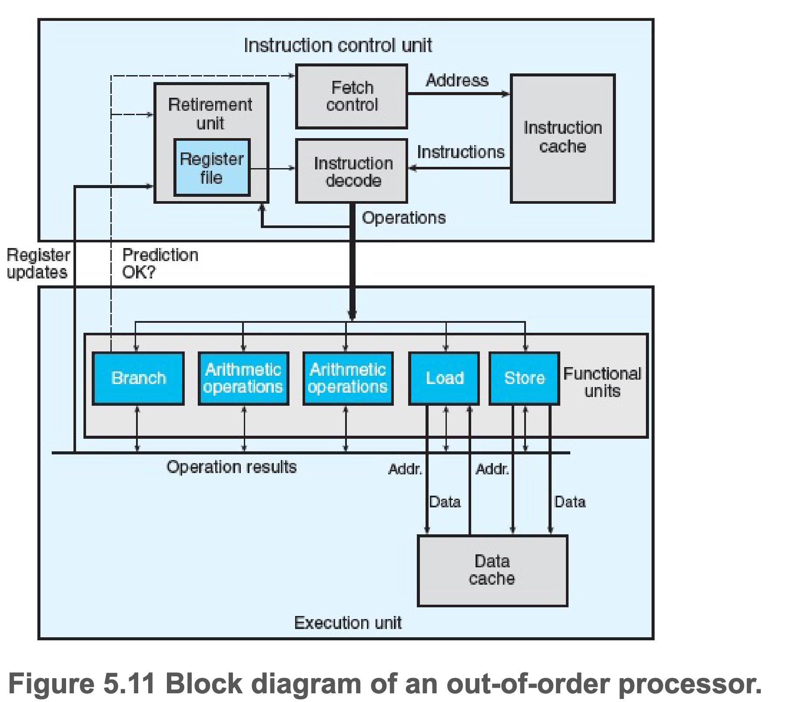

# 第五章 优化程序性能

CPE(Cycles per Element) 每个元素的周期数

## 乱序处理器

- 指令高速缓存(Instruction cache)和数据高速缓存(Data cache)存放着最近使用的指令和数据
- 指令控制单元ICU(Instruction Control Unit)从指令高速缓存中读取指令，译码后把操作发给执行单元EU(Execution Unit)
- 指令译码(Instruction decode)逻辑接收程序指令，并将它们转换成一组基本操作(有时被称为微操作)
- EU 接收来自取指单元的操作，分派给一组功能单元(Functional Units)执行
- 加载(Load)和存储(Store)单元通过数据高速缓存访问内存中的数据
- 退役单元(Retirement Unit)记录正在进行的处理，当一条指令完成且所有引起这条指令的分支点也都被确认预测正确，这条指令就可以退役了，任何对寄存器的更新都只会在指令退役时发生

### 功能单元的性能

- 延迟(latency): 表示完成运算需要的总时间
- 发射时间(issue time): 表示两个连续的同类型运算之间需要的最小时钟周期数
- 容量(capacity): 表示能够执行该运算的功能单位的数量
- 吞吐量(throughput): 定义为 容量/发射时间
- 循环因子: k，循环展开的数量
- 延迟界限: 单条指令最快速度
- 吞吐量界限: 多条指令的平均最快速度

#### 循环展开

假设一个循环内全做加法，循环展开为 2 个，在一次循环中加2次。
在没有达到延迟界限前，循环展开可以有效减少循环开销(i++)

#### 多个累积变量

在循环展开的基础上，设置 2 个加法累加变量 acc1 和 acc2，acc1 只加奇数，acc2 只加偶数。
多一个参数相当于多用一个寄存器，即多一条关键路径。
k >= C*L